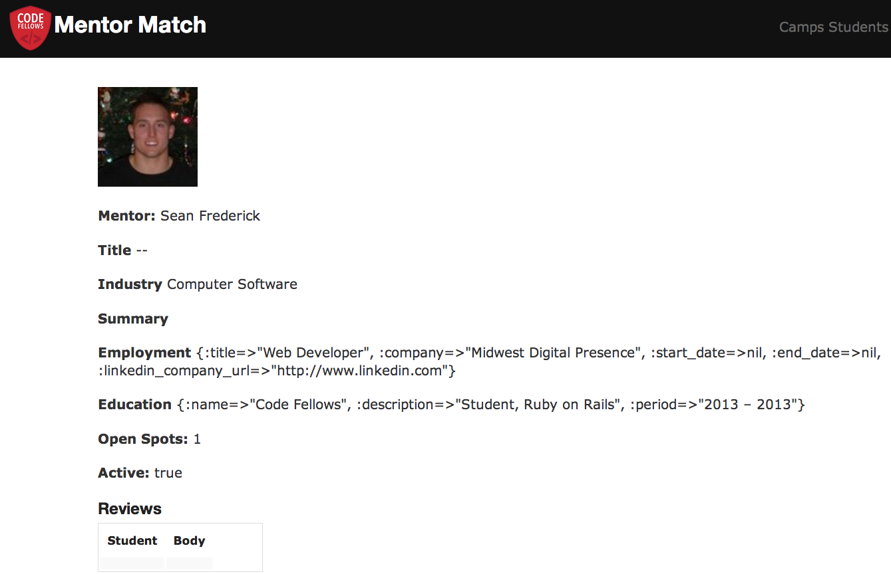
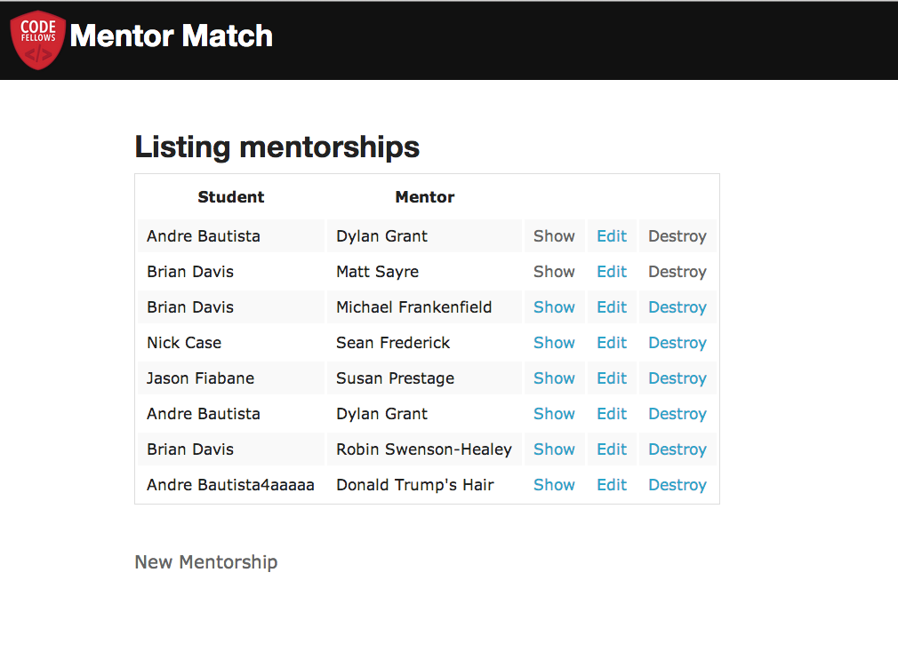

# Mentor Match App v2.0

By [Sean Frederick](sean.frederick.1@gmail.com)
By [Michael Frankenfield](http://www.mfrank.io)

## About
The Mentor Match Application was created for use to link CodeFellows Students with Seattle Tech Industry Professionals to gain career advice and expand their network in the programming world.

This application was created using Ruby on Rails, Zurb.

# The Student User can:
* Create a student profile derived from scraping their LinkedIn profile.
* Reserve a mentor from the mentor database and create a mentorship.

# The Admin User can:
* Create a camp for a group of students.
* Review mentorships database.

## Screenshots

## Contributing
1. Fork it
2. Create your feature branch (`git checkout -b my-new-feature`)
3. Commit your changes (`git commit -am 'Add some feature'`)
4. Push to the branch (`git push origin my-new-feature`)
5. Create new Pull Request

## License
Your Licensing Information goes here. Example: MIT/X11.

